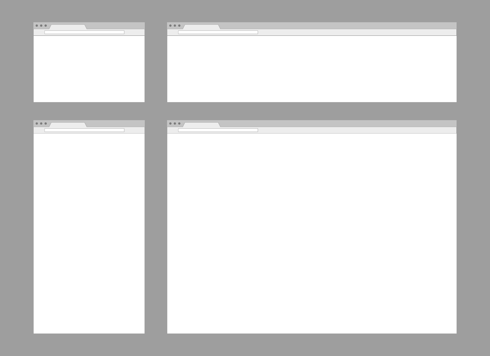
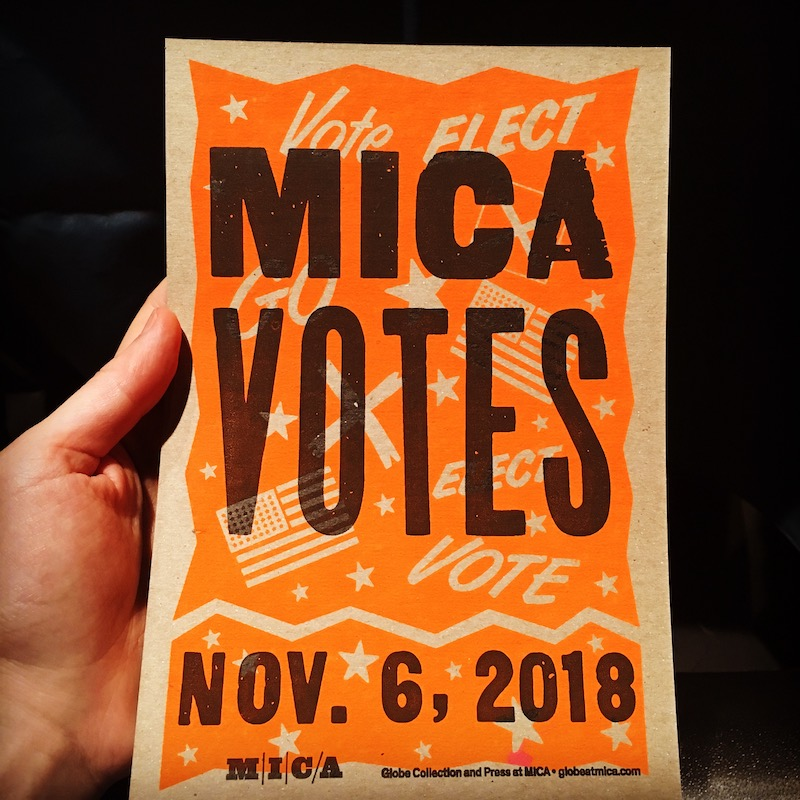

# Project: Responsive Poster

Responsive web design is an approach to web design that makes web pages render well on a variety of devices and window or screen sizes. (from [Wikipedia](https://en.wikipedia.org/wiki/Responsive_web_design)) We will apply the same concpet to poster design to create a poster that works on multiple screen sizes and proportions. With this project, we move away from creating a single outcome/product, and focus on working with rules to design a system that can respond to different conditions.

**Create a responsive poster to promote voting on November 6th.** The poster must be non-partisan. Please refrain from making expressions to support or attack any particular people or political parties. You can instead focus on supporting/helping/informing people exercise their own rights in a democratic society.

## Process

Choose an audience group you want to communicate your message with. Do some research on the group and on the voting/election itself. Come up with an appropriate visual style based on your research. Use animation/interaction to create more engaging experience.

Once you come up with a design direction, create digital mockups for four basic static layouts (see image below). This still layouts will serve as a visual guide when you start coding HTML and CSS. 

*You can download the AI template above [here](../files/responsive-poster-layout-template.ai)*

All the elements in the poster should be properly set in HTML and CSS. For instance, all the fonts you use should be *web fonts*, meaning you cannot just use the fonts on your computer because users may not have the same fonts on their computers. All text elements must be set as HTML text (not as images) for accessibility. All the geometric shapes should be set either as CSS or SVG. You can use videos or other interactive elements as part of your poster.

The responsive poster will be designed for a web browser, but you can think about other contexts as well - the same design may be used for banners, social media, brochure, postcard, etc.

## Deliverable
- A responsive poster that works in a browser at any size.
- The poster must be non-partisan.
- Submit a project folder that contains all the files (html, css, images, etc.).
- Your codes must be readable and cleanly formatted. 

## References
- [AIGA Get Out The Vote](https://www.aiga.org/vote) 2016
- [AIGA Get Out The Vote Toolkit](https://aigagotv.com)
- [AIGA Design for Democracy](https://www.aiga.org/design-for-democracy)

## Examples
The responsive poster is fairly new concept and there are not many examples out there. But you can search for 'responsive design' in general to learn about the techniques and approaches. Also, search for moving posters to get inspirations. 
- Responsive poster [1](https://www.instagram.com/p/BjULj9aj5ai/?taken-by=cdaein), [2](https://www.instagram.com/p/BjYbPgDBjSq/?taken-by=cdaein), [3](https://www.instagram.com/p/Bjze9JFDd3M/?taken-by=cdaein)
- [Studio Feixen](https://www.instagram.com/studiofeixen/)
  - [Oto Nove Swiss](http://www.otonoveswiss.co.uk)
- [The Moving Poster](http://www.themovingposter.com)
- [Google Trends visualized](https://trends.google.com/trends/hottrends/visualize?nrow=5&ncol=5)

## Schedule

### Week 2
Project 1 assigned  
Develop ideas, sketches, digital mockups

### Week 3
Review digital mockups  
Work on coding 

### Week 4
Work on coding

### Week 5
Project 1 due

